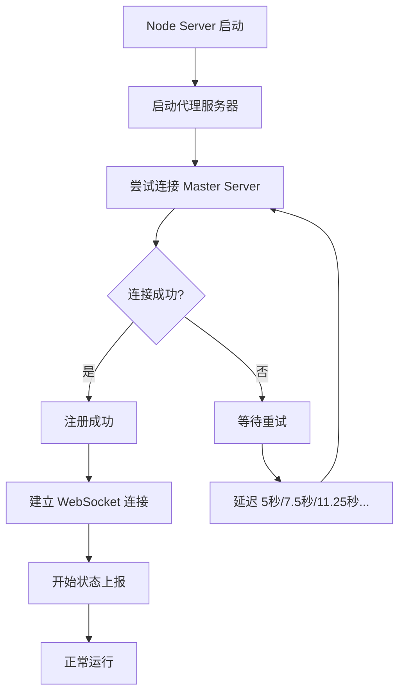

# 自动重试机制说明

## 📋 概述

ProxyNode 的 Node Server 现在支持自动重试连接 Master Server。当 Master Server 没有启动或暂时不可用时，Node Server 不会立即退出，而是会自动重试连接。

## ✨ 特性

### 1. **自动重试**
- Node Server 启动时会尝试连接 Master Server
- 如果连接失败，会自动重试
- 代理服务器保持运行，不受连接失败影响

### 2. **智能延迟**
- 使用指数退避策略（Exponential Backoff）
- 初始延迟：5 秒
- 每次重试后延迟增加 1.5 倍
- 最大延迟：60 秒

### 3. **无限重试**
- 默认配置为无限重试（推荐）
- 可自定义最大重试次数
- 适合生产环境，确保高可用性

## 🚀 工作流程



## 📖 使用方法

### 场景 1：先启动 Node，后启动 Master

这是最常见的场景：

```bash
# 1. 先启动 Node Server（Master 还未启动）
npm run start:node
```

**输出示例：**
```
[NodeServer] 正在启动节点服务器...
[NodeServer] 配置加载完成
[NodeServer] 监听地址: 0.0.0.0
[NodeServer] Master Server: http://192.168.1.100:3000
[NodeServer] HTTP 代理服务器启动在 0.0.0.0:8081
[NodeServer] SOCKS5 代理服务器启动在 0.0.0.0:1081
[NodeServer] 代理服务器已启动，等待连接到 Master Server...
[NodeServer] 节点注册失败 (尝试 1): connect ECONNREFUSED 192.168.1.100:3000
[NodeServer] 5 秒后重试连接 Master Server...
[NodeServer] 节点注册失败 (尝试 2): connect ECONNREFUSED 192.168.1.100:3000
[NodeServer] 7 秒后重试连接 Master Server...
[NodeServer] 节点注册失败 (尝试 3): connect ECONNREFUSED 192.168.1.100:3000
[NodeServer] 11 秒后重试连接 Master Server...
```

```bash
# 2. 然后启动 Master Server
npm run start:master
```

**Node Server 输出：**
```
[NodeServer] 节点已注册: node-abc123
[NodeServer] WebSocket 连接已建立
[NodeServer] 节点服务器启动完成
```

### 场景 2：Master 重启时自动重连

当 Master Server 重启时，Node Server 会自动检测并重连（通过状态上报的失败）。

### 场景 3：网络临时中断

网络临时中断时，Node Server 会持续重试，恢复后自动重连。

## ⚙️ 配置选项

在 `.env` 文件中配置：

```bash
# 节点注册重试配置

# 最大重试次数
# -1 = 无限重试（推荐，生产环境）
# 0 = 不重试（失败立即退出）
# >0 = 指定次数（例如 10 表示最多重试 10 次）
NODE_REGISTER_MAX_RETRIES=-1

# 初始重试延迟（毫秒）
NODE_REGISTER_INITIAL_DELAY=5000
```

### 配置示例

#### 生产环境（推荐）
```bash
# 无限重试，永不放弃
NODE_REGISTER_MAX_RETRIES=-1
NODE_REGISTER_INITIAL_DELAY=5000
```

#### 开发环境
```bash
# 重试 10 次后退出
NODE_REGISTER_MAX_RETRIES=10
NODE_REGISTER_INITIAL_DELAY=3000
```

#### 测试环境
```bash
# 快速失败，不重试
NODE_REGISTER_MAX_RETRIES=0
NODE_REGISTER_INITIAL_DELAY=1000
```

## 📊 重试延迟时间表

| 重试次数 | 延迟时间 | 累计等待时间 |
|---------|---------|-------------|
| 1 | 5 秒 | 5 秒 |
| 2 | 7.5 秒 | 12.5 秒 |
| 3 | 11.25 秒 | 23.75 秒 |
| 4 | 16.875 秒 | 40.625 秒 |
| 5 | 25.3 秒 | ~66 秒 |
| 6 | 37.9 秒 | ~104 秒 |
| 7+ | 60 秒（最大） | 每次增加 60 秒 |

## 💡 最佳实践

### 1. **生产环境**
```bash
# 使用无限重试
NODE_REGISTER_MAX_RETRIES=-1
NODE_REGISTER_INITIAL_DELAY=5000
```

**原因：**
- 确保高可用性
- Master Server 重启时自动恢复
- 网络故障后自动重连

### 2. **开发环境**
```bash
# 有限重试，避免长时间等待
NODE_REGISTER_MAX_RETRIES=10
NODE_REGISTER_INITIAL_DELAY=3000
```

**原因：**
- 快速发现配置错误
- 避免无限等待

### 3. **容器化部署**
```bash
# 使用无限重试 + 容器编排
NODE_REGISTER_MAX_RETRIES=-1
NODE_REGISTER_INITIAL_DELAY=5000
```

配合 Docker Compose 或 Kubernetes 的健康检查和重启策略。

### 4. **监控告警**
虽然有自动重试，但仍建议设置监控：
- 监控连接失败次数
- 超过阈值时发送告警
- 及时发现系统问题

## 🔍 日志说明

### 正常连接
```
[NodeServer] 代理服务器已启动，等待连接到 Master Server...
[NodeServer] 节点已注册: node-abc123
[NodeServer] WebSocket 连接已建立
```

### 重试中
```
[NodeServer] 节点注册失败 (尝试 1): connect ECONNREFUSED
[NodeServer] 5 秒后重试连接 Master Server...
[NodeServer] 节点注册失败 (尝试 2): connect ECONNREFUSED
[NodeServer] 7 秒后重试连接 Master Server...
```

### 达到最大重试次数（如果配置了）
```
[NodeServer] 节点注册失败 (尝试 10/10): connect ECONNREFUSED
[NodeServer] 无法连接到 Master Server: 达到最大重试次数，注册失败
[NodeServer] 节点将继续运行，但无法与 Master Server 通信
[NodeServer] 请检查 Master Server 是否正常运行，以及配置是否正确
```

## 🐛 故障排查

### 问题 1：一直在重试，无法连接

**可能原因：**
1. Master Server 未启动
2. Master Server 地址配置错误
3. 网络不通
4. 防火墙阻止

**解决方案：**
```bash
# 1. 检查 Master Server 是否运行
curl http://YOUR_MASTER_IP:3000/api/nodes

# 2. 检查配置
cat .env | grep MASTER_URL

# 3. 测试网络连通性
ping YOUR_MASTER_IP
telnet YOUR_MASTER_IP 3000

# 4. 检查防火墙
# Windows: netsh advfirewall firewall show rule name=all
# Linux: sudo ufw status
```

### 问题 2：想要立即停止重试

**方法 1：停止 Node Server**
```bash
# Ctrl+C 或
# Windows PowerShell
Stop-Process -Name node

# Linux/Mac
pkill -f "node.*node-sdk"
```

**方法 2：修改配置**
修改 `.env`：
```bash
NODE_REGISTER_MAX_RETRIES=0
```
然后重启 Node Server。

### 问题 3：重试太快或太慢

修改初始延迟：
```bash
# 更快（3秒开始）
NODE_REGISTER_INITIAL_DELAY=3000

# 更慢（10秒开始）
NODE_REGISTER_INITIAL_DELAY=10000
```

## 🎯 使用建议

| 场景 | 最大重试次数 | 初始延迟 |
|------|-------------|---------|
| 生产环境 | -1（无限） | 5000ms |
| 开发环境 | 10 | 3000ms |
| 测试环境 | 3 | 2000ms |
| 容器部署 | -1（无限） | 5000ms |
| 调试模式 | 0（不重试） | - |

## 📚 相关文档

- [环境变量配置](ENV_CONFIGURATION.md)
- [故障排除指南](TROUBLESHOOTING.md)
- [部署指南](README.md)

---

**提示：** 自动重试机制让您可以更灵活地启动和管理服务，无需担心启动顺序。🚀
